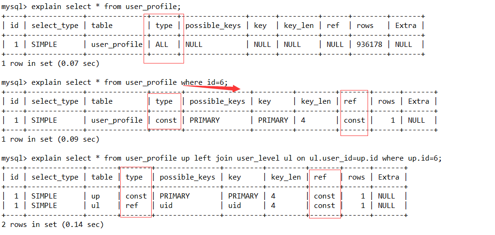
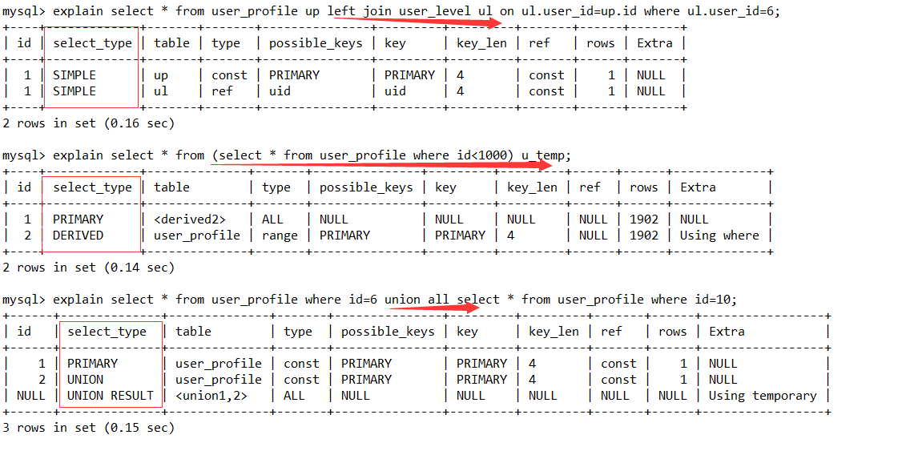

# MySQL Explain详解

## 作用

```

    通过 explain 命令获取 select 语句的执行计划，通过 explain 我们可以知道以下信息：表的读取顺序，数据读取操作的类型，哪些索引可以使用，哪些索引实际使用了，表之间的引用，每张表有多少行被优化器查询等信息。

    在 select 语句之前增加 explain 关键字，MySQL 会在查询上设置一个标记，执行查询时，会返回执行计划的信息，而不是执行这条SQL（如果 from 中包含子查询，仍会执行该子查询，将结果放入临时表中）。

```

# 示例



# id列

```
    id列的编号是 select 的序列号，有几个 select 就有几个id，并且id的顺序是按 select 出现的顺序增长的。
    
    1. id相同:执行顺序从上至下(mysql内部优化器加载表的顺序是从上到下)
    2. id不同:如果是子查询,id的序号会递增,id值越大优先级越高,越先被执行
    3.id部分相同:如果id相同,可以认为是一组从上往下顺序执行;在所有组中,id值越大优先级越高,越先被执行
```

# select_type列



```
1. simple：简单查询。查询不包含子查询和union
2. primary：复杂查询中最外层的 select
3. subquery：包含在 select 中的子查询（不在 from 子句中）
4. derived：包含在 from 子句中的子查询。MySQL会将结果存放在一个临时表中，也称为派生表（derived的英文含义）
5. union：在 union 中的第二个和随后的 select
6. union result：从 union 临时表检索结果的 select

```

# table列

```
    这一列表示 explain 的一行正在访问哪个表。

    当 from 子句中有子查询时，table列是 <derivenN> 格式，表示当前查询依赖 id=N 的查询，于是先执行 id=N 的查询。当有 union 时，UNION RESULT 的 table 列的值为 <union1,2>，1和2表示参与 union 的 select 行id。
    
```

# type列

```
    这一列表示关联类型或访问类型，即MySQL决定如何查找表中的行。
    
    依次从最优到最差分别为：system > const > eq_ref > ref > fulltext > ref_or_null > index_merge > unique_subquery > index_subquery > range > index > ALL

NULL：mysql能够在优化阶段分解查询语句，在执行阶段用不着再访问表或索引。例如：在索引列中选取最小值，可以单独查找索引来完成，不需要在执行时访问表

const、system： 当MySQL对查询某部分进行优化，并转换为一个常量时，使用这些类型访问。如将主键置于where列表中，MySQL就能将该查询转换为一个常量,system是const类型的特例，当查询的表只有一行的情况下，使用system

ref：相比 eq_ref，不使用唯一索引，而是使用普通索引或者唯一性索引的部分前缀，索引要和某个值相比较，可能会找到多个符合条件的行。连接匹配条件，即哪些列或常量被用于查找索引列上的值

eq_ref：primary key 或 unique key 索引的所有部分被连接使用 ，最多只会返回一条符合条件的记录。这可能是在 const 之外最好的联接类型了，简单的 select 查询不会出现这种 type。 类似ref，区别就在使用的索引是唯一索引，对于每个索引键值，表中只有一条记录匹配，简单来说，就是多表连接中使用primary key或者 unique key作为关联条件

range：范围扫描通常出现在 in(), between ,> ,<, >= 等操作中。使用一个索引来检索给定范围的行。

index：和ALL一样，不同就是mysql只需扫描索引树，这通常比ALL快一些。

ALL：即全表扫描，意味着mysql需要从头到尾去查找所需要的行。通常情况下这需要增加索引来进行优化了

ref_or_null：类似ref，但是可以搜索值为NULL的行。

index_merge：表示使用了索引合并的优化方法。
```

# possible_keys列
这一列显示查询可能使用哪些索引来查找。 

explain 时可能出现 possible_keys 有列，而 key 显示 NULL 的情况，这种情况是因为表中数据不多，mysql认为索引对此查询帮助不大，选择了全表查询。 

如果该列是NULL，则没有相关的索引。在这种情况下，可以通过检查 where 子句看是否可以创造一个适当的索引来提高查询性能，然后用 explain 查看效果。

# key列
这一列显示mysql实际采用哪个索引来优化对该表的访问。

如果没有使用索引，则该列是 NULL。如果想强制mysql使用或忽视possible_keys列中的索引，在查询中使用 force index、ignore index。

# key_len列
这一列显示了mysql在索引里使用的字节数，通过这个值可以算出具体使用了索引中的哪些列。 

    ```
    key_len计算规则如下：
        字符串
        char(n)：n字节长度
        varchar(n)：2字节存储字符串长度，如果是utf-8，则长度 3n + 2
        数值类型
        tinyint：1字节
        smallint：2字节
        int：4字节
        bigint：8字节　　
        时间类型　
        date：3字节
        timestamp：4字节
        datetime：8字节
        如果字段允许为 NULL，需要1字节记录是否为 NULL
        索引最大长度是768字节，当字符串过长时，mysql会做一个类似左前缀索引的处理，将前半部分的字符提取出来做索引。
    ```
# ref列
这一列显示了在key列记录的索引中，表查找值所用到的列或常量，常见的有：const（常量），func，NULL，字段名（例：film.id）

# rows列
这一列是mysql估计要读取并检测的行数，注意这个不是结果集里的行数。

# Extra列
这一列展示的是额外信息。常见的重要值如下：

    1. distinct: 一旦mysql找到了与行相联合匹配的行，就不再搜索了
    
    2. Using index：这发生在对表的请求列都是同一索引的部分的时候，返回的列数据只使用了索引中的信息，而没有再去访问表中的行记录。是性能高的表现。Using index不读数据文件，只从索引文件获取数据
    
    3. Using where：mysql服务器将在存储引擎检索行后再进行过滤。就是先读取整行数据，再按 where 条件进行检查，符合就留下，不符合就丢弃。Using where只是过滤元组，和是否读取数据文件或索引文件没有关系
    
    4. Using temporary：mysql需要创建一张临时表来处理查询。出现这种情况一般是要进行优化的，首先是想到用索引来优化。
    
    5. Using filesort：mysql 会对结果使用一个外部索引排序，而不是按索引次序从表里读取行。此时mysql会根据联接类型浏览所有符合条件的记录，并保存排序关键字和行指针，然后排序关键字并按顺序检索行信息。这种情况下一般也是要考虑使用索引来优化的。
    
[索引对去重的影响](Explain详解/索引对去重的影响.png)
[无索引排序](Explain详解/无索引排序.png)
[有索引排序](Explain详解/有索引排序.png)
[数据提取](Explain详解/数据提取.png)

