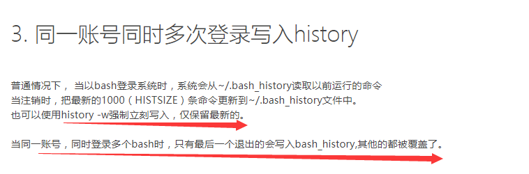

# history

n : 显示最新的多少条history

-c：clear the history list by deleting all of the entries. 清空history list。可以用 -r 选项再读回来。

-d offset：delete the history entry at offset OFFSET. 删除指定位置的命令历史

-a：append history lines from this session to the history file. 将新增的history追加到history file。

-r：read the history file and append the contents to the history list. 从history file读取命令并追加到history list。

-n：read all history lines not already read from the history file.

-w：write the current history to the history file and append them to the history list. 将当前的history写入history file。


history -a 与history -w的区别:

history -a仅仅会将会将新增的命令写入bash_history
history -w会将所有修改即将history命令的输出写入bash_history

## 1、显示最近10条命令历史

 history 10 

## 2、重复执行第N条命令

!n

## 3、重复执行倒数第N条命令

 !-n

## 4、重复执行上一条命令

 !!

## 5、重复执行最近一条以string开头的命令

 !string

## 6、调用上一条命令的最后一个参数：

a、快捷键：ESC+.
b、字符串：!$


## 7、定制history的功能，可通过环境变量实现

7.1、HISTSIZE：history可保留的命令历史的条数。如果这个值设置为0，则不记录history。
7.2、HISTFILE：命令历史文件位置。默认为 .bash_history，清空或者删除该文件，可以清除命令历史记录。
7.3、HISTFILESIZE：命令历史记录条数。（.bash_history文件)
7.4、HISTTIMEFORMAT：显示时间

```

HISTCONTROL：控制命令历史记录

HISTCONTROL=ignoredups：忽略连续重复的命令。
HISTCONTROL=ignorespace：忽略以空白字符开头的命令。
HISTCONTROL=ignoreboth：同时忽略以上两种。
HISTCONTROL=erasedups：忽略所有历史命令中的重复命令。

# vim /etc/profile
export HISTTIMEFORMAT="%F %T `whoami` "    这里插入了whoami用来显示命令的操作用户
export HISTSIZE=100000
export HISTFILESIZE=20000

在历史记录文件中在所有的条目前面添加上时间戳
HISTTIMEFORMAT="%F %T "


如果你不希望经常执行的命令充斥在历史记录中，请使用：
HISTCONTROL=ignorespace:erasedups
这样，每次重新登录系统时会去掉之前的重复命令,然后再加载到缓冲区,每使用一个命令时，都会从历史记录文件中删除之前出现的所有相同命令，并且只将最后一次调用保存到历史记录列表中。
```

## 清空history

当前session执行的命令，放置在缓存中，正常退出或关闭时，会把缓存信息写入 ~/.bash_history。
当session直接被kill时，缓存中的命令不会写入 ~/.bash_history。

1、清空历史命令文件

# > ~/.bash_history
2、清空当前缓存中的命令

# history -c
3、直接关闭终端即可。

如果不想保留任何痕迹，退出时不要敲exit，这样exit会被保存。


