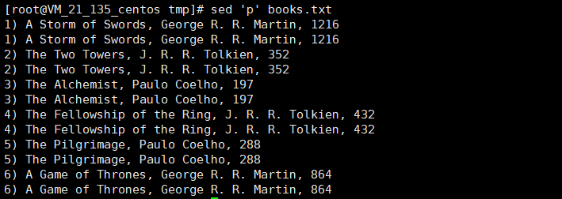

---
title: sed入门
date: 2018-04-09 09:27:40
tags:
-linux
-文件操作
categories:
-linux
-文件操作
---


<ul>
<li><a href="#introduce">介绍</a></li>
<li><a href="#grammar">基础语法</a>
<ul>
<li><a href="#p">执行p命令</a></li>
<li><a href="#address">行寻址</a>
<ol>
<li><a href="#number_address">使用数字模式的行寻址</a>
<ol>
<li><a href="#+">+操作符</a></li>
<li><a href="#~">~操作符</a></li>
<li><a href="#$">$用法</a></li>
</ol>
</li>
<li><a href="#word_address">使用文本模式的行寻址</a></li>
</ol>
</li>
</ul>
</li>
<li><a href="#command">基础命令</a>
<ul>
<li><a href="#d">删除命令 d</a></li>
<li><a href="#a">追加命令 a</a></li>
<li><a href="#i">插入命令 i</a></li>
<li><a href="#c">行替换命令 c</a></li>
<li><a href="#s">替换命令 s</a></li>
<li><a href="#escaping">转义</a></li>
<li><a href="#reference">引用</a></li>
<li><a href="#!">排除命令 !</a></li>
<li><a href="#&">&命令 存储匹配模式的内容</a></li>
<li><a href="#=">=命令 打印行号</a></li>
<li><a href="#l">输出隐藏字符命令 l</a></li>
</ul></li>
<li><a href="#expression">正则表达式</a></li>
</ul>


<h2 id="introduce">介绍</h2>

1.用途

* 文本替换
* 选择性的输出文本文件
* 从文本文件的某处开始编辑
* <em style="color:red;">无交互式的对文本文件进行编辑</em>

2.原理


* 读取： SED从输入流（文件，管道或者标准输入）中读取一行并且存储到它叫做 模式空间（pattern buffer） 的内部缓冲区

* 执行： 默认情况下，所有的SED命令都在模式空间中顺序的执行，除非指定了行的地址，否则SED命令将会在所有的行上依次执行

* 显示： 发送修改后的内容到输出流。在发送数据之后，模式空间将会被清空。
在文件所有的内容都被处理完成之前，上述过程将会重复执行

需要注意的几点:

1.模式空间 （pattern buffer） 是一块活跃的缓冲区，在sed编辑器执行命令时它会保存待检查的文本
默认情况下，所有的SED命令都是在模式空间中执行，因此输入文件并不会发生改变

2.如果没有提供输入文件的话，SED将会从标准输入接收请求

3.如果没有提供地址范围的话，默认情况下SED将会对所有的行进行操作

<h2 id="grammar">基础语法</h2>

    sed [-n] [-e] 'command(s)' files 
    sed [-n] -f scriptfile files

标准选项
SED支持下列标准选项：

    -n 默认情况下，模式空间中的内容在处理完成后将会打印到标准输出，该选项用于阻止该行为(仅显示script处理后的结果)
        
    -e 指定要执行的命令，使用该参数，我们可以指定多个命令，让我们打印每一行两次：
        
    -f 指定包含要执行的命令的脚本文件

 
GNU选项
这些选项是GNU规范定义的，可能对于某些版本的SED并不支持。

    -n， --quiet, --slient：与标准的-n选项相同
    
    -e script，--expression=script：与标准的-e选项相同
    
    -f script-file， --file=script-file：与标准的-f选项相同
    
    --follow-symlinks：如果提供该选项的话，在编辑的文件是符号链接时，SED将会跟随链接
    
    -i[SUFFIX]，--in-place[=SUFFIX]：该选项用于对当前文件进行编辑，如果提供了SUFFIX的话，将会备份原始文件，否则将会覆盖原始文件
    
    -l N， --line-lenght=N：该选项用于设置行的长度为N个字符
    
    --posix：该选项禁用所有的GNU扩展
    
    -r，--regexp-extended：该选项将启用扩展的正则表达式
    
    -u， --unbuffered：指定该选项的时候，SED将会从输入文件中加载最少的数据，并且更加频繁的刷出到输出缓冲区。在编辑tail
    
    -f命令的输出，你不希望等待输出的时候该选项是非常有用的。
    
    -z，--null-data：默认情况下，SED对每一行使用换行符分割，如果提供了该选项的话，它将使用NULL字符分割行
    
    cat books.txt
        1) A Storm of Swords, George R. R. Martin, 1216 
        2) The Two Towers, J. R. R. Tolkien, 352 
        3) The Alchemist, Paulo Coelho, 197 
        4) The Fellowship of the Ring, J. R. R. Tolkien, 432 
        5) The Pilgrimage, Paulo Coelho, 288 
        6) A Game of Thrones, George R. R. Martin, 864

<span id="p">(1)执行p命令</span>

sed 'p' books.txt


你可能会疑惑，为什么每一行被显示了两次？

你还记得SED的工作流吗？默认情况下，SED将会输出模式空间中的内容，另外，我们的命令中包含了输出命令p，因此每一行被打印两次。但是不要担心，SED提供了**-n**参数用于禁止自动输出模式空间的每一行的行为

    $ sed -n 'p' books.txt 

        1) A Storm of Swords, George R. R. Martin, 1216 
        2) The Two Towers, J. R. R. Tolkien, 352 
        3) The Alchemist, Paulo Coelho, 197 
        4) The Fellowship of the Ring, J. R. R. Tolkien, 432 
        5) The Pilgrimage, Paulo Coelho, 288 
        6) A Game of Thrones, George R. R. Martin, 864 
        
<h2 id="address">行寻址</h2>

&nbsp;&nbsp;&nbsp;&nbsp;默认情况下，在SED中使用的命令会作用于文本数据的所有行。如果只想将命令作用于特定的行或者某些行，则需要使用行寻址功能。

<em style="color:red;">
在SED中包含两种形式的行寻址：

以数字形式表示的行区间
以文本模式来过滤行

[address]command
</em>

<h2 id="number_address">数字方式的行寻址</h2>

1.打印第3行

    sed -n '3p' books.txt 
    
        3) The Alchemist, Paulo Coelho, 197 
2.逗号**,**分隔输出行号的范围(打印2-5行)

    sed -n '2,5 p' books.txt 
    
        2) The Two Towers, J. R. R. Tolkien, 352 
        3) The Alchemist, Paulo Coelho, 197 
        4) The Fellowship of the Ring, J. R. R. Tolkien, 432 
        5) The Pilgrimage, Paulo Coelho, 288
        
<span id="$">3.特殊字符 $ 代表了文件的最后一行，输出文件的最后一行</span>

        sed -n '$ p' books.txt 
            
            6) A Game of Thrones, George R. R. Martin, 864 
            
  &nbsp;&nbsp;&nbsp;打印第3行到最后一行
        
        sed -n '3,$ p' books.txt
        
            3) The Alchemist, Paulo Coelho, 197
            4) The Fellowship of the Ring, J. R. R. Tolkien, 432
            5) The Pilgrimage, Paulo Coelho,288
            6) A Game of Thrones, George R. R. Martin, 864
            
            
<span id="+">4.加号（+）操作符，它可以与逗号（,）操作符一起使用，例如 M, +n 将会打印出M行以及后面的n行(输出第2行及其后面的4行)</span>

<em style="color:red;">同时支持两种寻址方式</em>
        
        sed -n '2,+4 p' books.txt 
            
            2) The Two Towers, J. R. R. Tolkien, 352 
            3) The Alchemist, Paulo Coelho, 197 
            4) The Fellowship of the Ring, J. R. R. Tolkien, 432 
            5) The Pilgrimage, Paulo Coelho, 288 
            6) A Game of Thrones, George R. R. Martin, 864
          
        sed -n '/Alchemist/,+2 p' books.txt 
        
            3) The Alchemist, Paulo Coelho, 197 
            4) The Fellowship of the Ring, J. R. R. Tolkien, 432 
            5) The Pilgrimage, Paulo Coelho, 288 
            
        sed -n '/Alchemist/,+3 p' books.txt 
        
            3) The Alchemist, Paulo Coelho, 197 
            4) The Fellowship of the Ring, J. R. R. Tolkien, 432 
            5) The Pilgrimage, Paulo Coelho, 288 
            6) A Game of Thrones, George R. R. Martin, 864
            
         sed '1,+4 d' books.txt 
        
            6) A Game of Thrones, George R. R. Martin, 864
            
        sed '1,+4 a liuzeming' books.txt 
        
            1) A Storm of Swords, George R. R. Martin, 1216 
            liuzeming
            2) The Two Towers, J. R. R. Tolkien, 352 
            liuzeming
            3) The Alchemist, Paulo Coelho, 197 
            liuzeming
            4) The Fellowship of the Ring, J. R. R. Tolkien, 432 
            liuzeming
            5) The Pilgrimage, Paulo Coelho, 288 
            liuzeming
            6) A Game of Thrones, George R. R. Martin, 864    
 
 <span id="~">5.波浪线操作符（~）指定地址范围，它使用M~N的形式，它告诉SED应该处理从M行开始，每隔N行才输出</span>           

&nbsp;&nbsp;&nbsp;&nbsp;50~5匹配行号50，55，60，65

&nbsp;&nbsp;&nbsp;&nbsp;只输出文件中的奇数行

        sed -n '1~2 p' books.txt 
        
            1) A Storm of Swords, George R. R. Martin, 1216 
            3) The Alchemist, Paulo Coelho, 197 
            5) The Pilgrimage, Paulo Coelho, 288
            
&nbsp;&nbsp;&nbsp;&nbsp;只输出文件中的偶数行

        sed -n '2~2 p' books.txt 
        
            2) The Two Towers, J. R. R. Tolkien, 352 
            4) The Fellowship of the Ring, J. R. R. Tolkien, 432 
            6) A Game of Thrones, George R. R. Martin, 864 
            
        sed '2~2 d' books.txt 
         
            1) A Storm of Swords, George R. R. Martin, 1216 
            3) The Alchemist, Paulo Coelho, 197 
            5) The Pilgrimage, Paulo Coelho, 288
            
        sed '2~2 a liuzeming' books.txt 
        
            1) A Storm of Swords, George R. R. Martin, 1216 
            2) The Two Towers, J. R. R. Tolkien, 352 
            liuzeming
            3) The Alchemist, Paulo Coelho, 197 
            4) The Fellowship of the Ring, J. R. R. Tolkien, 432 
            liuzeming
            5) The Pilgrimage, Paulo Coelho, 288 
            6) A Game of Thrones, George R. R. Martin, 864
            liuzeming
            
<h2 id="word_address">使用文本模式的行寻址</h2>

SED编辑器允许指定文本模式来过滤出命令要作用的行。格式如下：

/pattern/ command
必须用正斜线将要指定的pattern封起来。sed编辑器会将该命令作用到包含指定文本模式的行上

1.打印所有作者为Paulo Coelho的书籍。

    sed -n '/Paulo/ p' books.txt
    
        3) The Alchemist, Paulo Coelho, 197 
        5) The Pilgrimage, Paulo Coelho, 288

2.模式匹配也可以与数字形式的寻址同时使用(从第一次匹配到Alchemist开始输出，直到第5行为止)

    sed -n '/Alchemist/, 5 p' books.txt
    
        3) The Alchemist, Paulo Coelho, 197 
        4) The Fellowship of the Ring, J. R. R. Tolkien, 432 
        5) The Pilgrimage, Paulo Coelho, 288
        
3.使用逗号（,）操作符指定匹配多个匹配的模式(输出Two和Pilgrimage之间的所有行)

    sed -n '/Two/, /Pilgrimage/ p' books.txt
    
        2) The Two Towers, J. R. R. Tolkien, 352 
        3) The Alchemist, Paulo Coelho, 197 
        4) The Fellowship of the Ring, J. R. R. Tolkien, 432 
        5) The Pilgrimage, Paulo Coelho, 288
        
4.在使用文本模式过滤器的时候，与数字方式的行寻址类似，可以使用加号操作符 +，它会输出从第一次匹配的行以及后面的n行(输出第一次Two出现的位置开始接下来的4行)

    sed -n '/Two/, +4 p' books.txt
    
        2) The Two Towers, J. R. R. Tolkien, 352 
        3) The Alchemist, Paulo Coelho, 197 
        4) The Fellowship of the Ring, J. R. R. Tolkien, 432 
        5) The Pilgrimage, Paulo Coelho, 288 
        6) A Game of Thrones, George R. R. Martin, 864 
        
<h2 id="command">基本命令</h2>

<span id="d">1.删除命令 d</span>

删除命令格式如下:

[address1[,address2]]d

address1和address2是开始和截止地址，它们可以是行号或者字符串匹配模式，这两种地址都是可选的。

&nbsp;&nbsp;&nbsp;&nbsp;由命令的名称可以知道，delete命令是用来执行删除操作的，并且因为SED是基于行的编辑器，因此我们说该命令是用来删除行的。<em style="color:red;">注意的是，该命令只会移除模式空间中的行，这样该行就不会被发送到输出流，但原始内容不会改变。</em>

    sed 'd' books.txt 

&nbsp;&nbsp;&nbsp;&nbsp;为什么没有输出任何内容？默认情况下，SED将会对每一行执行删除操作，这就是该命令为什么没有在标准输出中输出任何内容的原因。

&nbsp;&nbsp;&nbsp;只移除第四行

    sed '4 d' books.txt
    
        1) A Storm of Swords, George R. R. Martin, 1216 
        2) The Two Towers, J. R. R. Tolkien, 352 
        3) The Alchemist, Paulo Coelho, 197 
        5) The Pilgrimage, Paulo Coelho, 288 
        6) A Game of Thrones, George R. R. Martin, 864
        
&nbsp;&nbsp;&nbsp;删除2-4行

    sed '2, 4 d' books.txt
    
        1) A Storm of Swords, George R. R. Martin, 1216 
        5) The Pilgrimage, Paulo Coelho, 288 
        6) A Game of Thrones, George R. R. Martin, 864

&nbsp;&nbsp;&nbsp;移除所有作者为Paulo Coelho的书籍

    sed '/Paulo Coelho/d' books.txt 
    
        1) A Storm of Swords, George R. R. Martin, 1216 
        2) The Two Towers, J. R. R. Tolkien, 352 
        4) The Fellowship of the Ring, J. R. R. Tolkien, 432 
        6) A Game of Thrones, George R. R. Martin, 864
        
&nbsp;&nbsp;&nbsp;移除第一次匹配Storm，第一次匹配Fellowship之间的所有行

    sed '/Storm/,/Fellowship/d' books.txt  
    
        5) The Pilgrimage, Paulo Coelho, 288 
        6) A Game of Thrones, George R. R. Martin, 864 
        
<span id="a">2.追加命令 a</span>

文本追加命令语法：

[address] a Append text 

&nbsp;&nbsp;&nbsp;在第四行之后追加一本新书：

    sed '4 a 7) Adultry, Paulo Coelho, 234' books.txt 

        1) A Storm of Swords, George R. R. Martin, 1216 
        2) The Two Towers, J. R. R. Tolkien, 352 
        3) The Alchemist, Paulo Coelho, 197 
        4) The Fellowship of the Ring, J. R. R. Tolkien, 432 
        7) Adultry, Paulo Coelho, 234 
        5) The Pilgrimage, Paulo Coelho, 288 
        6) A Game of Thrones, George R. R. Martin, 864
        
    在命令部分，4指的是行号，a 是append命令，剩余部分为要追加的文本。

&nbsp;&nbsp;&nbsp;在文件的结尾插入一行文本，使用 $ 作为地址

    sed '$ a 7) Adultry, Paulo Coelho, 234' books.txt
    
        1) A Storm of Swords, George R. R. Martin, 1216 
        2) The Two Towers, J. R. R. Tolkien, 352 
        3) The Alchemist, Paulo Coelho, 197 
        4) The Fellowship of the Ring, J. R. R. Tolkien, 432 
        5) The Pilgrimage, Paulo Coelho, 288 
        6) A Game of Thrones, George R. R. Martin, 864 
        7) Adultry, Paulo Coelho, 234 
        
&nbsp;&nbsp;&nbsp;在匹配 The Alchemist 的行之后追加文本

    sed '/The Alchemist/ a 7) Adultry, Paulo Coelho, 234' books.txt 
    
        1) A Storm of Swords, George R. R. Martin, 1216 
        2) The Two Towers, J. R. R. Tolkien, 352 
        3) The Alchemist, Paulo Coelho, 197 
        7) Adultry, Paulo Coelho, 234 
        4) The Fellowship of the Ring, J. R. R. Tolkien, 432 
        5) The Pilgrimage, Paulo Coelho, 288 
        6) A Game of Thrones, George R. R. Martin, 864
        
<span id="c">3.行替换命令 c</span>

&nbsp;&nbsp;&nbsp;&nbsp;SED通过 c 提供了 change 和 replace 命令，该命令帮助我们使用新文本替换已经存在的行，当提供行的地址范围时，所有的行都被作为一组被替换为单行文本<em style="color:red;">如果选中的行连续,将作为一个整体被新的文本替换</em>，下面是该命令的语法:

[address1[,address2]] c Replace text

&nbsp;&nbsp;&nbsp;替换文本中的第三行为新的内容

    sed '3 c 3) Adultry, Paulo Coelho, 324' books.txt
    
        1) A Storm of Swords, George R. R. Martin, 1216 
        2) The Two Towers, J. R. R. Tolkien, 352 
        3) Adultry, Paulo Coelho, 324 
        4) The Fellowship of the Ring, J. R. R. Tolkien, 432 
        5) The Pilgrimage, Paulo Coelho, 288 
        6) A Game of Thrones, George R. R. Martin, 864

&nbsp;&nbsp;&nbsp;第4-6行内容替换为单行

    sed '4, 6 c 4) Adultry, Paulo Coelho, 324' books.txt  
        
        1) A Storm of Swords, George R. R. Martin, 1216 
        2) The Two Towers, J. R. R. Tolkien, 352 
        3) The Alchemist, Paulo Coelho, 197 
        4) Adultry, Paulo Coelho, 324

&nbsp;&nbsp;&nbsp;SED也接受模式作为地址(替换所有含The Alchemist的行)

    sed '/The Alchemist/ c 3) Adultry, Paulo Coelho, 324' books.txt
    
        1) A Storm of Swords, George R. R. Martin, 1216 
        2) The Two Towers, J. R. R. Tolkien, 352 
        3) Adultry, Paulo Coelho, 324 
        4) The Fellowship of the Ring, J. R. R. Tolkien, 432 
        5) The Pilgrimage, Paulo Coelho, 288 
        6) A Game of Thrones, George R. R. Martin, 864 

&nbsp;&nbsp;&nbsp;替换所有含The的行 

    sed '/The/ c 3) Adultry, Paulo Coelho, 324' books.txt
    
        1) A Storm of Swords, George R. R. Martin, 1216 
        3) Adultry, Paulo Coelho, 324
        3) Adultry, Paulo Coelho, 324
        3) Adultry, Paulo Coelho, 324
        3) Adultry, Paulo Coelho, 324
        6) A Game of Thrones, George R. R. Martin, 864
        
<span id="i">4.插入命令 i</span>

&nbsp;&nbsp;&nbsp;&nbsp;插入命令与追加命令类似，唯一的区别是插入命令是在匹配的位置前插入新的一行。

[address] i Insert text 

&nbsp;&nbsp;&nbsp;在第4行前插入新的一行

    sed '4 i 7) Adultry, Paulo Coelho, 324' books.txt
    
        1) A Storm of Swords, George R. R. Martin, 1216 
        2) The Two Towers, J. R. R. Tolkien, 352 
        3) The Alchemist, Paulo Coelho, 197 
        7) Adultry, Paulo Coelho, 324 
        4) The Fellowship of the Ring, J. R. R. Tolkien, 432 
        5) The Pilgrimage, Paulo Coelho, 288 
        6) A Game of Thrones, George R. R. Martin, 864

&nbsp;&nbsp;&nbsp;在第4-5行前插入新的一行

    sed '4,5 i 7) Adultry, Paulo Coelho, 324' books.txt
   
        1) A Storm of Swords, George R. R. Martin, 1216 
        2) The Two Towers, J. R. R. Tolkien, 352 
        3) The Alchemist, Paulo Coelho, 197 
        7) Adultry, Paulo Coelho, 324
        4) The Fellowship of the Ring, J. R. R. Tolkien, 432 
        7) Adultry, Paulo Coelho, 324
        5) The Pilgrimage, Paulo Coelho, 288 
        6) A Game of Thrones, George R. R. Martin, 864
        
<span id="s">5.替换命令 s</span>

文本替换命令非常常见，其格式如下

[address1[,address2]] s/pattern/replacement/[flags]

&nbsp;&nbsp;&nbsp;使用替换命令将其替换为管道符“|”：

    sed 's/,/ |/' books.txt
    
        1) Storm of Swords | George R. R. Martin, 1216
        2) The Two Towers | J. R. R. Tolkien, 352
        3) The Alchemist | Paulo Coelho, 197
        4) The Fellowship of the Ring | J. R. R. Tolkien, 432
        5) The Pilgrimage | Paulo Coelho, 288
        6) A Game of Thrones | George R. R. Martin, 864
        
&nbsp;&nbsp;&nbsp;&nbsp;是不是觉得哪里不对？相信你已经发现，每一行的第二个逗号都没有被替换，只有第一个被替换了，确实如此，在SED中，使用替换命令的时候默认只会对第一个匹配的位置进行替换。使用g选项告诉SED对所有内容进行替换：

    sed 's/,/ | /g' books.txt
    
        1) Storm of Swords |  George R. R. Martin |  1216
        2) The Two Towers |  J. R. R. Tolkien |  352
        3) The Alchemist |  Paulo Coelho |  197
        4) The Fellowship of the Ring |  J. R. R. Tolkien |  432
        5) The Pilgrimage |  Paulo Coelho |  288
        6) A Game of Thrones |  George R. R. Martin |  864
        
&nbsp;&nbsp;&nbsp;&nbsp;如果对匹配模式（或地址范围）的行进行替换，则只需要在s命令前添加地址即可。

&nbsp;&nbsp;&nbsp;只替换匹配The Pilgrimage的行：

    sed '/The Pilgrimage/ s/,/ | /g' books.txt
        
        1) A Storm of Swords, George R. R. Martin, 1216 
        2) The Two Towers, J. R. R. Tolkien, 352 
        3) The Alchemist, Paulo Coelho, 197 
        4) The Fellowship of the Ring, J. R. R. Tolkien, 432 
        5) The Pilgrimage |  Paulo Coelho |  288 
        6) A Game of Thrones, George R. R. Martin, 864

还有一些其它的选项，这里就简单的描述一下，不在展开讲解

    数字n: 只替换第n次匹配，比如sed 's/,/ | /2' books.txt 只替换每行中第二个逗号
    p：只输出改变的行，比如sed -n 's/Paulo Coelho/PAULO COELHO/p' books.txt
    w：存储改变的行到文件，比如sed -n 's/Paulo Coelho/PAULO COELHO/w junk.txt' books.txt
    i：匹配时忽略大小写，比如sed 's/pAuLo CoElHo/PAULO COELHO/pi' books.txt

<span id="escaping">转义</span>

在执行替换操作的时候，如果要替换的内容中包含/，这个时候怎么办？很简单，添加转义操作符。

$ echo "/bin/sed" | sed 's/\/bin\/sed/\/home\/mylxsw\/src\/sed\/sed-4.2.2\/sed/'
/home/mylxsw/src/sed/sed-4.2.2/sed

&nbsp;&nbsp;&nbsp;&nbsp;上面的命令中，我们使用\对/进行了转义，不过表达式已经看起来非常难看了，在SED中还可以使用|，@，^，!作为命令的分隔符，所以，下面的几个命令和上面的是等价的

echo "/bin/sed" | sed 's|/bin/sed|/mylxsw/mylxsw/src/sed/sed-4.2.2/sed|'
echo "/bin/sed" | sed 's@/bin/sed@/home/mylxsw/src/sed/sed-4.2.2/sed@'
echo "/bin/sed" | sed 's^/bin/sed^/home/mylxsw/src/sed/sed-4.2.2/sed^'
echo "/bin/sed" | sed 's!/bin/sed!/home/mylxsw/src/sed/sed-4.2.2/sed!'

<span id="reference">引用</span>


在SED中，使用\(和\)对匹配的内容进行分组，使用\N的方式进行引用。请看下面示例

    echo "Three One Two" | sed 's|\(\w\+\) \(\w\+\) \(\w\+\)|\2 \3 \1|'
        
        One Two Three
        
&nbsp;&nbsp;&nbsp;&nbsp;我们输出了Three，One，Two三个单词，在SED的替换规则中，使用空格分隔了三小段正则表达式\(\w\+\)来匹配每一个单词，后面使用\1，，\2，\3分别引用它们的值。

<span id="!">6.排除命令 !</span>

感叹号命令（!）用来排除命令，也就是让原本会起作用的命令不起作用。

&nbsp;&nbsp;&nbsp;只输出匹配Paulo的行 
    
    sed -n '/Paulo/p' books.txt
    
        3) The Alchemist, Paulo Coelho, 197 
        5) The Pilgrimage, Paulo Coelho, 288
        
&nbsp;&nbsp;&nbsp;只输出不匹配Paulo的行 

    sed -n '/Paulo/!p' books.txt
    
        1) A Storm of Swords, George R. R. Martin, 1216 
        2) The Two Towers, J. R. R. Tolkien, 352 
        4) The Fellowship of the Ring, J. R. R. Tolkien, 432 
        6) A Game of Thrones, George R. R. Martin, 864


<span id="=">7. =命令 打印行号</span>

=命令用于输出行号，语法格式为

[/pattern/]= 
[address1[,address2]]=

&nbsp;&nbsp;&nbsp;为每一行输出行号

    sed '=' books2.txt
        1
        A Storm of Swords
        2
        George R. R. Martin
        ...
        
&nbsp;&nbsp;&nbsp;只为1-4行输出行号

    sed '1, 4=' books2.txt
        1
        A Storm of Swords
        2
        George R. R. Martin
        3
        The Two Towers
        4
        J. R. R. Tolkien
        The Alchemist
        Paulo Coelho
        The Fellowship of the Ring
        J. R. R. Tolkien
        The Pilgrimage
        Paulo Coelho
        A Game of Thrones
        George R. R. Martin
        
&nbsp;&nbsp;&nbsp;匹配Paulo的行输出行号

    sed '/Paulo/ =' books2.txt
        A Storm of Swords
        George R. R. Martin
        The Two Towers
        J. R. R. Tolkien
        The Alchemist
        6
        Paulo Coelho
        The Fellowship of the Ring
        J. R. R. Tolkien
        The Pilgrimage
        10
        Paulo Coelho
        A Game of Thrones
        George R. R. Martin
        
&nbsp;&nbsp;&nbsp;输出文件总共有多少行

    sed -n '$ =' books.txt
        6
        

<span id="&">8. &命令 存储匹配模式的内容</span>

特殊字符&用于存储匹配模式的内容，通常与替换命令s一起使用。

    sed 's/The/Book number &/' books.txt

        1) A Storm of Swords, George R. R. Martin, 1216 
        2) Book number The Two Towers, J. R. R. Tolkien, 352 
        3) Book number The Alchemist, Paulo Coelho, 197 
        4) Book number The Fellowship of the Ring, J. R. R. Tolkien, 432 
        5) Book number The Pilgrimage, Paulo Coelho, 288 
        6) A Game of Thrones, George R. R. Martin, 864
    这里的&包含的内容就是The
    

<span id="l">9. 输出隐藏字符命令 l</span>

你能通过直接观察区分出单词是通过空格还是tab进行分隔的吗？显然是不能的，但是SED可以为你做到这点。使用l命令（英文字母L的小写）可以显示文本中的隐藏字符（例如\t或者$字符）。

[address1[,address2]]l 
[address1[,address2]]l [len] 

为了测试该命令，我们首先将books.txt中的空格替换为tab。

    sed 's/ /\t/g' books.txt > junk.txt 
    
接下来执行l命令

    sed -n 'l' junk.txt
    
        1)\tStorm\tof\tSwords,\tGeorge\tR.\tR.\tMartin,\t1216\t$
        2)\tThe\tTwo\tTowers,\tJ.\tR.\tR.\tTolkien,\t352\t$
        3)\tThe\tAlchemist,\tPaulo\tCoelho,\t197\t$
        4)\tThe\tFellowship\tof\tthe\tRing,\tJ.\tR.\tR.\tTolkien,\t432\t$
        5)\tThe\tPilgrimage,\tPaulo\tCoelho,\t288\t$
        6)\tA\tGame\tof\tThrones,\tGeorge\tR.\tR.\tMartin,\t864$
        
&nbsp;&nbsp;&nbsp;使用l命令的时候，一个很有趣的特性是我们可以使用它来实现文本按照指定的宽度换行。

    sed -n 'l 25' books.txt
    
        1) Storm of Swords, Geor\
        ge R. R. Martin, 1216 $
        2) The Two Towers, J. R.\
         R. Tolkien, 352 $
        3) The Alchemist, Paulo \
        Coelho, 197 $
        4) The Fellowship of the\
         Ring, J. R. R. Tolkien,\
         432 $
        5) The Pilgrimage, Paulo\
         Coelho, 288 $
        6) A Game of Thrones, Ge\
        orge R. R. Martin, 864$
        
&nbsp;&nbsp;&nbsp;上面的示例中在l命令后跟了一个数字25，它告诉SED按照每行25个字符进行换行，如果指定这个数字为0的话，则只有在存在换行符的情况下才进行换行。   

##  sed在指定字符前后添加内容

```
cat /tmp/input.txt

    null
    000011112222

    test
    
 (1) 在1111之前添加AAA,方法如下:
 
 sed -i 's/指定的字符/要插入的字符&/'  文件
 
 sed -i  's/1111/AAA&/' /tmp/input.txt 
 
 (2)  在1111之后添加BBB，方法如下:
 
 sed -i 's/指定的字符/&要插入的字符/'  文件
 
 sed -i  's/1111/&BBB/' /tmp/input.txt
  
 (3)  (1) 删除所有空行；(2) 一行中，如果包含"1111"，则在"1111"前面插入"AAA"，在"11111"后面插入"BBB"
 
 sed '/^$/d;s/1111/AAA&/;s/1111/&BBB/' /tmp/input.txt

 (4)  在每行的头添加字符，比如"HEAD"，命令如下:
 
 sed -i 's/^/HEAD&/' /tmp/input.txt
 
 (5)  在每行的尾部添加字符，比如"tail"，命令如下:
 
 sed -i 's/$/&tail/' /tmp/input.txt  
```

__1. &作反向引用，代替前面的匹配项__

__2. "^"代表行首，"$"代表行尾__

__3. 's/$/&tail/g'中的字符g代表每行出现的字符全部替换，如果想在特定字符处添加，g就有用了，否则只会替换每行第一个，而不继续往后找。__

## 删除文件每一行的前k个字符、在文本的行尾或行首添加字符

```
cat tmp.txt 
123456789

# 删除每行第一个字符
sed 's/.//' tmp.txt 

23456789

# 删除每行前两个字符
sed 's/..//' tmp.txt 

3456789

# 删除每行前k个字符，例如k=5
sed 's/.\{5\}//' tmp.txt 

6789


cat tmp.txt 
23456789

# 在行首添加双引号(")
cat tmp.txt | sed 's/^/"&/g'
"23456789
"23456789
"23456789

# 在行尾添加双引号和逗号(",)
cat tmp.txt | sed 's/^/"&/g' | sed 's/$/",&/g'
"23456789",
"23456789",
"23456789",

```

<h2 id="expression">正则表达式</h2>

1.^ 匹配行的开始

    echo -e "Call\nTall\nBall" | sed -n '/^C/ p'
    
        Call
2.$ 匹配行的结尾

    echo -e "str1\nstr2\nstr3\nstr4\nstr33" | sed -n '/3$/ p'
    
        str3
        str33
        
3..匹配单个字符（除行尾）

    echo -e "cat\nbat\nrat\nmat\nbatting\nrats\nmats" | sed -n '/^..t$/p'
    
        cat
        bat
        rat
        mat
        
4.[] 匹配字符集

    echo -e "Call\nTall\nBall" | sed -n '/[CT]all/ p'
    
        Call
        Tall

5.[^] 排除字符集

    echo -e "Call\nTall\nBall" | sed -n '/[^CT]all/ p'
        
        Ball
        
6.[-] 字符范围

    echo -e "Call\nTall\nBall" | sed -n '/[C-Z]all/ p'
    
        Call 
        Tall
        
7.? ，\+ ，*

分别对应0次到1次，一次到多次，0次到多次匹配。

8.{n} ，{n,} ，{m, n}

精确匹配N次，至少匹配N次，匹配M-N次

9.|或操作。

    echo -e "str1\nstr2\nstr3\nstr4" | sed -n '/str\(1\|3\)/ p' 
    
        str1
        str3

10.\s匹配单个空白内容

    echo -e "Line\t1\nLine2" | sed -n '/Line\s/ p'
        
        Line 1 
        
11.\S匹配单个非空白内容。

12.\w ， \W单个单词、非单词

不支持\d
