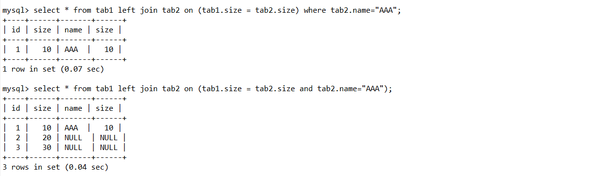
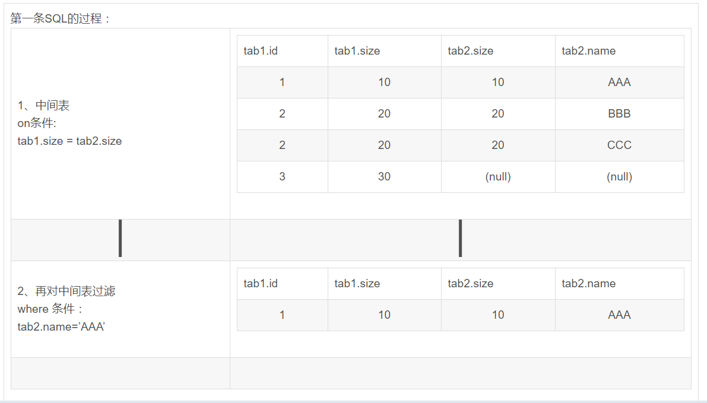
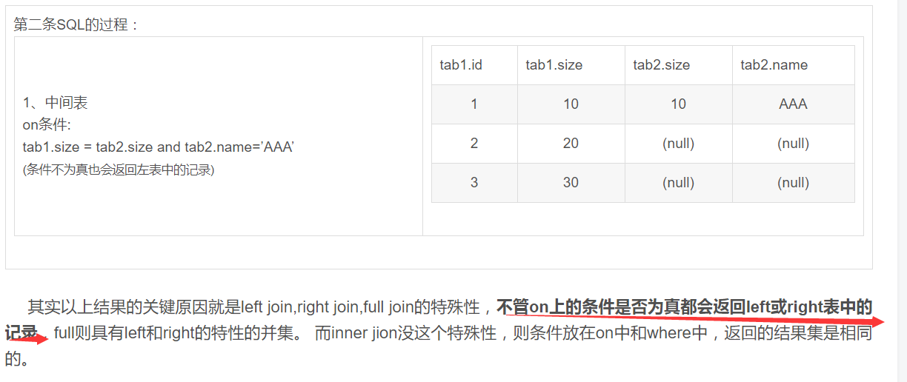
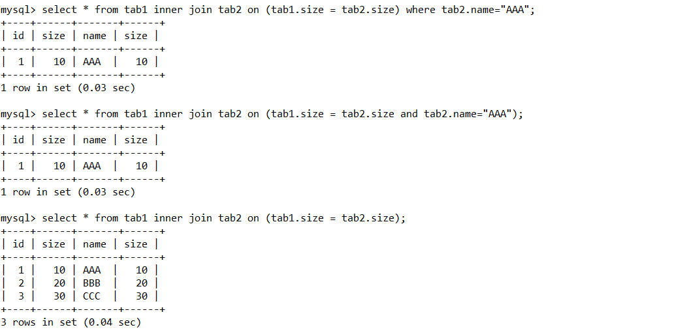

# 在关联查询时on和where的区别

1. 对于left join，不管on后面跟什么条件，左表的数据全部查出来，因此要想过滤需把条件放到where后面, __在on里面过滤数据时无效的__

__2. 对于inner join，满足on后面的条件表的数据才能查出，可以起到过滤作用。也可以把条件放到where后面。__

SQL中on条件与where条件的区别
       数据库在通过连接两张或多张表来返回记录时，都会生成一张中间的临时表，然后再将这张临时表返回给用户。

      在使用left jion时，on和where条件的区别如下：

1、 on条件是在生成临时表时使用的条件，它不管on中的条件是否为真，都会返回左边表中的记录。

2、where条件是在临时表生成好后，再对临时表进行过滤的条件。这时已经没有left join的含义（必须返回左边表的记录）了，条件不为真的就全部过滤掉。

## 测试

```
create table tab1
(
	`id` int(11),
	`size` int(11)
);

create table tab2
(
	`name` varchar(50),
	`size` int(11)
);

insert into tab1 values(1, 10),(2,20),(3,30);
insert into tab1 values("AAA", 10),("BBB", 20),("CCC", 30);
```





## on、where、having的区别

    on、where、having这三个都可以加条件的子句中，on是最先执行，where次之，having最后。有时候如果这先后顺序不影响中间结果的话，那最终结果是相同的。但因为on是先把不符合条件的记录过滤后才进行统计，它就可以减少中间运算要处理的数据，按理说应该速度是最快的。   
    在多表联接查询时，on比where更早起作用。系统首先根据各个表之间的联接条件，把多个表合成一个临时表后，再由where进行过滤，然后再计算，计算完后再由having进行过滤。由此可见，要想过滤条件起到正确的作用，首先要明白这个条件应该在什么时候起作用，然后再决定放在那里

    
```
对于JOIN参与的表的关联操作，如果需要不满足连接条件的行也在我们的查询范围内的话，我们就必需把连接条件放在ON后面，而不能放在WHERE后面，如果我们把连接条件放在了WHERE后面，那么所有的LEFT,RIGHT,等这些操作将不起任何作用，对于这种情况，它的效果就完全等同于INNER连接。对于那些不影响选择行的条件，放在ON或者WHERE后面就可以。

记住：所有的连接条件都必需要放在ON后面，不然前面的所有LEFT,和RIGHT关联将作为摆设，而不起任何作用。
```


