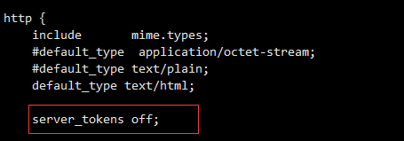
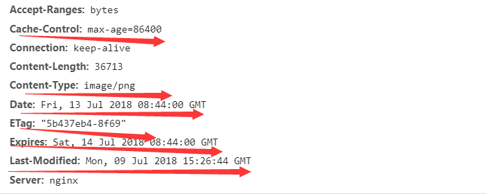

# Nginx的日常使用

1. 隐藏nginx版本号
```
在http配置中加上 server_tokens off;
```



2. 定义日志为json格式
```
在http配置中加上:

log_format access_log_json '{
        "remote_host":"$scheme:://$host",
        "client_ip":"$remote_addr",
		"user_ip":"$http_x_real_ip",
		"xforward":"$http_x_forwarded_for",
		"@timestamp":"$time_iso8601",
		"time_local":"$time_local",
		"cost":"$request_time",
		"request_uri":"$request_uri",
		"uri":"$uri",
		"request":"$request",
		"document_uri":"$document_uri",
		"referrer":"$http_referrer",
		"method":"$http_method",
		"http_version":"$server_protocol",
		"http_code":"$status",
		"body_bytes_sents":"$body_bytes_sent",
		"agent":"$http_user_agent"
	}';

location: access_log filename access_log_json
```
3. 在响应中添加header头
```
location

add_header HEADER_NAME HEADER_VALUE;
```

4. 自定义某一些状态码的错误页面
```
server

error_page HTTP_CODE = HTTP_URL;

example: error_page 404 = http://www.37.com/404.html;
```


5. 跨域处理
```
location /example {
   if ($request_method = 'OPTIONS') {
       add_header Access-Control-Allow-Origin *;
       add_header Access-Control-Max-Age 1728000;
       add_header Access-Control-Allow-Methods GET,POST,OPTIONS;
       add_header Access-Control-Allow-Headers  'DNT,User-Agent,X-Requested-With,If-Modified-Since,Cache-Control,Content-Type,Range';
       add_header Content-Type' 'text/plain; charset=utf-8';
       add_header Content-Length 0 ;
       return 204;
    }

  if ($http_origin ~* (https?://(.+\.)?(example\.com$))) {
     add_header  Access-Control-Allow-Origin $http_origin;
     add_header  Access-Control-Allow-Credentials true;
     add_header  Access-Control-Allow-Methods GET,POST,OPTIONS;
     add_header  Access-Control-Expose-Headers Content-Length,Content-Range;
   }

    proxy_redirect off;
    proxy_set_header Host $host;
    proxy_set_header X-Real-IP $remote_addr;
    proxy_set_header X-Forwarded-For $proxy_add_x_forwarded_for;
    proxy_pass http://127.0.0.1:8080/;
   }
   
   if ($request_method = 'OPTIONS') {...} 当请求方法为 OPTIONS 时:

添加允许源 Access-Control-Allow-Origin 为 * (可根据业务需要更改)
添加缓存时长 Access-Control-Max-Age，当下次请求时，无需再发送 OPTIONS 请求
添加允许的方法，允许的首部
添加一个内容长度为0，类型为 text/plain; charset=utf-8 , 返回状态码为 204 的首部
至此，完成 OPTIONS 请求的正确响应。


if ($http_origin ~* (https?://(.+\.)?(example\.com$))) {...}, 当 origin 为合法域名(可根据业务调整或去除合法域名验证)时:

添加允许源Access-Control-Allow-Origin为 $http_origin (可根据业务需要更改)
添加允许认证Access-Control-Allow-Credentials为 true ，允许接收客户端 Cookie(可根据业务需要更改。 但要注意，当设置为true时，Access-Control-Allow-Origin 不允许设置为 *)
添加允许的方法，暴露的首部
至此，完成跨域请求正确响应。
```

6. 设置静态文件过期时间
```
location

expireds 1d
```



6. 日志分割
```
#!/bin/bash

d=$(date -d "-1 day" "+%Y%m%d") #显示一天前的时间

logs_path="/var/log/nginx"

pid_path="/var/run/nginx/nginx.pid"

project_name=$1

[ -d $logs_path ] || mkdir -p $logs_path

mv ${logs_path}/${project_name}.access.log ${logs_path}/${project_name}-access.log-$d

#创建新日志文件
kill -USR1 $(cat $pid_path)

#删除30天前的日志文件
find $logs_path -mtime +30 | xargs rm -rf

    USR1亦通常被用来告知应用程序重载配置文件；例如，向Apache HTTP服务器发送一个USR1信号将导致以下步骤的发生：停止接受新的连接，等待当前连接停止，重新载入配置文件，重新打开日志文件，重启服务器，从而实现相对平滑的不关机的更改。
```
7. 防盗链
```
location ~.(jpg|gif|swf)$ { #匹配.jpg 、.gif 、或 .swf结尾的文件

valid_referers none blocked .abc.com abc.com; #信任域名站点

if ( $invalid_referer ) {

rewrite ^/ http://www.abc.com/error.png; #重写返回error.png

}
```
8. 动态添加模块
```
load_module "modules/ngx_http_echo_module.so";
```

9. gizp压缩
```
gzip on;

gzip_buffers 4 64k;

gzip_http_version 1.1;

gzip_comp_level 2;

gzip_min_length 1k;

gzip_vary on;

gzip_types text/plain text/javascript application/x-javascript text/css text/xml application/xml application/xml+rss text/jpg text/png;
```

！[gzip压缩](Nginx的日常使用/gzip压缩.png)