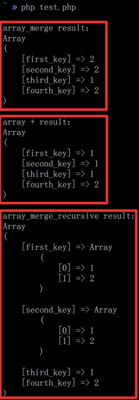
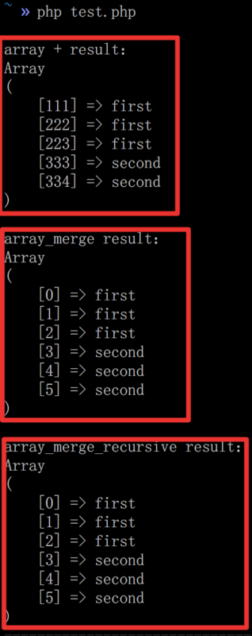

# PHP三种数组合并方式区别示例

## 相同字符串键

```
<?php

$arrFirst = [
    "first_key"  => 1,
    "second_key" => 1,
    "third_key"  => 1,
];

$arrSecond = [
    "first_key"  => 2,
    "second_key" => 2,
    "fourth_key" => 2,
];

//对于重复的字符串键，array_merge后，后面数组的键值会覆盖前面的
echo sprintf("\narray_merge result：\n%s", print_r(array_merge($arrFirst, $arrSecond), true));

//对于重复的字符串键，+操作后，前面数组的键值会覆盖后面的
echo sprintf("\narray + result：\n%s", print_r($arrFirst + $arrSecond, true));

//对于重复的字符串键，array_merge_recursive后，相同键名的键值会被合并到同一数组中（会递归）
echo sprintf("\narray_merge_recursive result：\n%s", print_r(array_merge_recursive($arrFirst, $arrSecond), true));

```


## 相同数字键

```
<?php

$arrFirst = [
    111 => "first",
    222 => "first",
    "first" //会指定默认的数字键223
];

$arrSecond = [
    111 => "second",
    333 => "second",
    "second" //会指定默认的数字键334
];

//对于重复的数字键，+操作后，前面数组的键值会覆盖后面的，保留之前数字键
echo sprintf("\narray + result：\n%s", print_r($arrFirst + $arrSecond, true));

//对于重复的数字键，array_merge后，重排数字键，不会覆盖
echo sprintf("\narray_merge result：\n%s", print_r(array_merge($arrFirst, $arrSecond), true));

//对于重复的数字键，array_merge_recursive后，重排数字键，不会覆盖
echo sprintf("\narray_merge_recursive result：\n%s", print_r(array_merge_recursive($arrFirst, $arrSecond), true));
```

