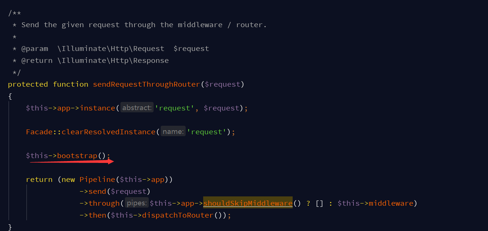

# laravel启动分析

##初始化Application##

```
$app = new Illuminate\Foundation\Application(
    realpath(__DIR__.'/../')
);
```


(1) 设置项目根路径

(2) 注册基本绑定


(3)注册基本服务提供者


    将会调用服务提供者的register、boot方法
    
(4)注册核心服务容器别名

```
 public function registerCoreContainerAliases()
    {
        foreach ([
            'app'                  => [\Illuminate\Foundation\Application::class, \Illuminate\Contracts\Container\Container::class, \Illuminate\Contracts\Foundation\Application::class],
            'auth'                 => [\Illuminate\Auth\AuthManager::class, \Illuminate\Contracts\Auth\Factory::class],
            'auth.driver'          => [\Illuminate\Contracts\Auth\Guard::class],
            'blade.compiler'       => [\Illuminate\View\Compilers\BladeCompiler::class],
            'cache'                => [\Illuminate\Cache\CacheManager::class, \Illuminate\Contracts\Cache\Factory::class],
            'cache.store'          => [\Illuminate\Cache\Repository::class, \Illuminate\Contracts\Cache\Repository::class],
            'config'               => [\Illuminate\Config\Repository::class, \Illuminate\Contracts\Config\Repository::class],
            'cookie'               => [\Illuminate\Cookie\CookieJar::class, \Illuminate\Contracts\Cookie\Factory::class, \Illuminate\Contracts\Cookie\QueueingFactory::class],
            'encrypter'            => [\Illuminate\Encryption\Encrypter::class, \Illuminate\Contracts\Encryption\Encrypter::class],
            'db'                   => [\Illuminate\Database\DatabaseManager::class],
            'db.connection'        => [\Illuminate\Database\Connection::class, \Illuminate\Database\ConnectionInterface::class],
            'events'               => [\Illuminate\Events\Dispatcher::class, \Illuminate\Contracts\Events\Dispatcher::class],
            'files'                => [\Illuminate\Filesystem\Filesystem::class],
            'filesystem'           => [\Illuminate\Filesystem\FilesystemManager::class, \Illuminate\Contracts\Filesystem\Factory::class],
            'filesystem.disk'      => [\Illuminate\Contracts\Filesystem\Filesystem::class],
            'filesystem.cloud'     => [\Illuminate\Contracts\Filesystem\Cloud::class],
            'hash'                 => [\Illuminate\Contracts\Hashing\Hasher::class],
            'translator'           => [\Illuminate\Translation\Translator::class, \Illuminate\Contracts\Translation\Translator::class],
            'log'                  => [\Illuminate\Log\Writer::class, \Illuminate\Contracts\Logging\Log::class, \Psr\Log\LoggerInterface::class],
            'mailer'               => [\Illuminate\Mail\Mailer::class, \Illuminate\Contracts\Mail\Mailer::class, \Illuminate\Contracts\Mail\MailQueue::class],
            'auth.password'        => [\Illuminate\Auth\Passwords\PasswordBrokerManager::class, \Illuminate\Contracts\Auth\PasswordBrokerFactory::class],
            'auth.password.broker' => [\Illuminate\Auth\Passwords\PasswordBroker::class, \Illuminate\Contracts\Auth\PasswordBroker::class],
            'queue'                => [\Illuminate\Queue\QueueManager::class, \Illuminate\Contracts\Queue\Factory::class, \Illuminate\Contracts\Queue\Monitor::class],
            'queue.connection'     => [\Illuminate\Contracts\Queue\Queue::class],
            'queue.failer'         => [\Illuminate\Queue\Failed\FailedJobProviderInterface::class],
            'redirect'             => [\Illuminate\Routing\Redirector::class],
            'redis'                => [\Illuminate\Redis\RedisManager::class, \Illuminate\Contracts\Redis\Factory::class],
            'request'              => [\Illuminate\Http\Request::class, \Symfony\Component\HttpFoundation\Request::class],
            'router'               => [\Illuminate\Routing\Router::class, \Illuminate\Contracts\Routing\Registrar::class, \Illuminate\Contracts\Routing\BindingRegistrar::class],
            'session'              => [\Illuminate\Session\SessionManager::class],
            'session.store'        => [\Illuminate\Session\Store::class, \Illuminate\Contracts\Session\Session::class],
            'url'                  => [\Illuminate\Routing\UrlGenerator::class, \Illuminate\Contracts\Routing\UrlGenerator::class],
            'validator'            => [\Illuminate\Validation\Factory::class, \Illuminate\Contracts\Validation\Factory::class],
            'view'                 => [\Illuminate\View\Factory::class, \Illuminate\Contracts\View\Factory::class],
        ] as $key => $aliases) {
            foreach ($aliases as $alias) {
                $this->alias($key, $alias);
            }
        }
    }
```

##注册共享的Kernel和异常处理器、绑定自己的单例类##

```
$app = new Illuminate\Foundation\Application(
    realpath(__DIR__.'/../')
);

$app->singleton(
    Illuminate\Contracts\Http\Kernel::class,
    App\Http\Kernel::class
);

$app->singleton(
    Illuminate\Contracts\Console\Kernel::class,
    App\Console\Kernel::class
);

$app->singleton(
    Illuminate\Contracts\Debug\ExceptionHandler::class,
    App\Exceptions\Handler::class
);

$app->singleton('redis', function () {
    $redis = new Predis\Client([
        'host' => env('REDIS_HOST', '127.0.0.1'),
        'port' => env('REDIS_PORT', '6379'),
        'database' => env('REDIS_DATABASE', '0'),
        'timeout' => 0,
        'read_write_timeout' => 0
    ]);
    return $redis;
});

$app->configureMonologUsing(function ($logger) {
    $logger->pushHandler(new RotatingFileHandler(env('LOG_PATH', '/tmp') . '/dish.main.log'), 10);
    return $logger;
});

return $app;

```

##处理请求和响应##

(1) 解析Illuminate\Contracts\Http\Kernel，实例化App\Http\Kernel

```
$kernel = $app->make(Illuminate\Contracts\Http\Kernel::class);

$response = $kernel->handle(
    $request = Illuminate\Http\Request::capture()
);

 $request = Illuminate\Http\Request::capture()  作用是将$_GET、$_COOKIE等请求相关数据包装为对象，方便调用
```


    设置$app/$router，初始化$router中middleware数值
    
(2) handle处理请求




1. $request是经过Symfony封装的请求对象

2. 注册request实例到容器 ($app['request']->Illuminate\Http\Request)

3. 清空之前容器中的request实例

4. 调用bootstrap方法，启动一系列启动类的bootstrap方法：

```
protected $bootstrappers = [
        \Illuminate\Foundation\Bootstrap\LoadEnvironmentVariables::class,
        \Illuminate\Foundation\Bootstrap\LoadConfiguration::class,
        \Illuminate\Foundation\Bootstrap\HandleExceptions::class,
        \Illuminate\Foundation\Bootstrap\RegisterFacades::class,
        \Illuminate\Foundation\Bootstrap\RegisterProviders::class,
        \Illuminate\Foundation\Bootstrap\BootProviders::class,
    ];
```
```
(1) env文件解析,设置到$_ENV、$_SERVER数组, 便于env函数即getenv读取

\Illuminate\Foundation\Bootstrap\LoadEnvironmentVariables::class

(2) config基本配置

\Illuminate\Foundation\Bootstrap\LoadConfiguration::class

(3) 错误&异常处理

Illuminate\Foundation\Bootstrap\HandleExceptions::class 

(4) 清除已解析的Facade并重新启动，注册config文件中alias定义的所有Facade类到容器

Illuminate\Foundation\Bootstrap\RegisterFacades::class   

(5) 注册config中providers定义的所有Providers类到容器

Illuminate\Foundation\Bootstrap\RegisterProviders::class 

(6) 调用所有已注册Providers的boot方法

Illuminate\Foundation\Bootstrap\BootProviders::class      

```

5. 通过Pipeline发送请求，经过中间件，再由路由转发，最终返回响应


##将响应信息发送到浏览器##

##处理继承自TerminableMiddleware接口的中间件（Session）并结束应用生命周期##