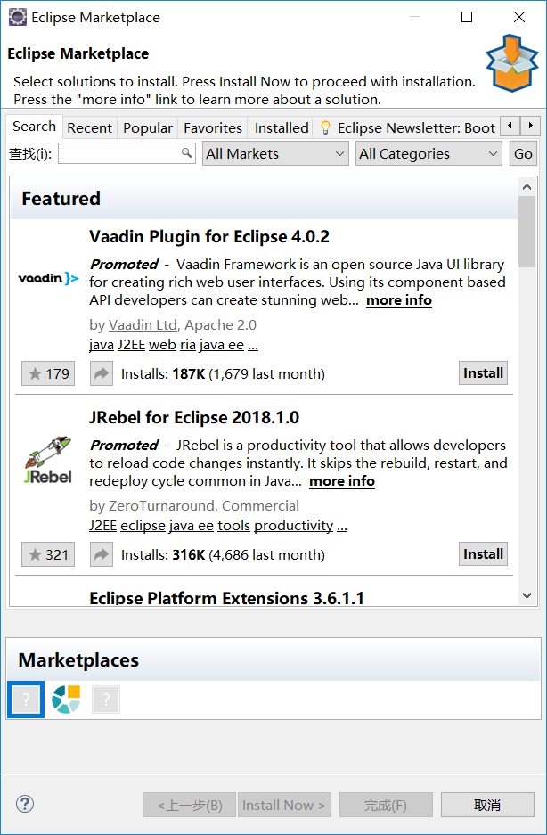
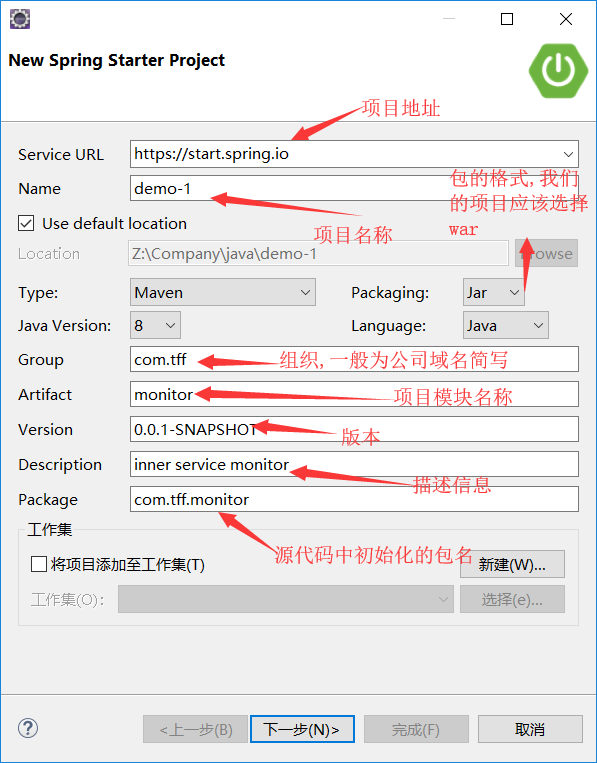
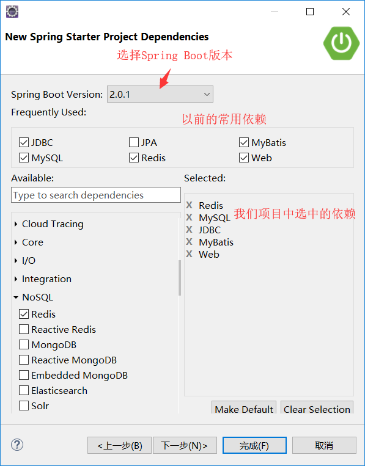
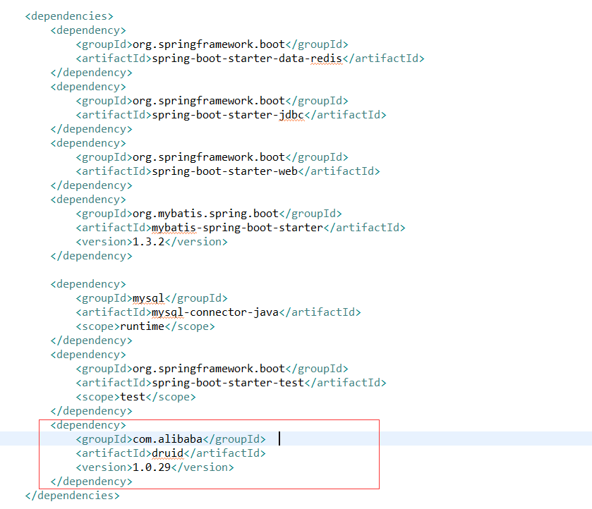
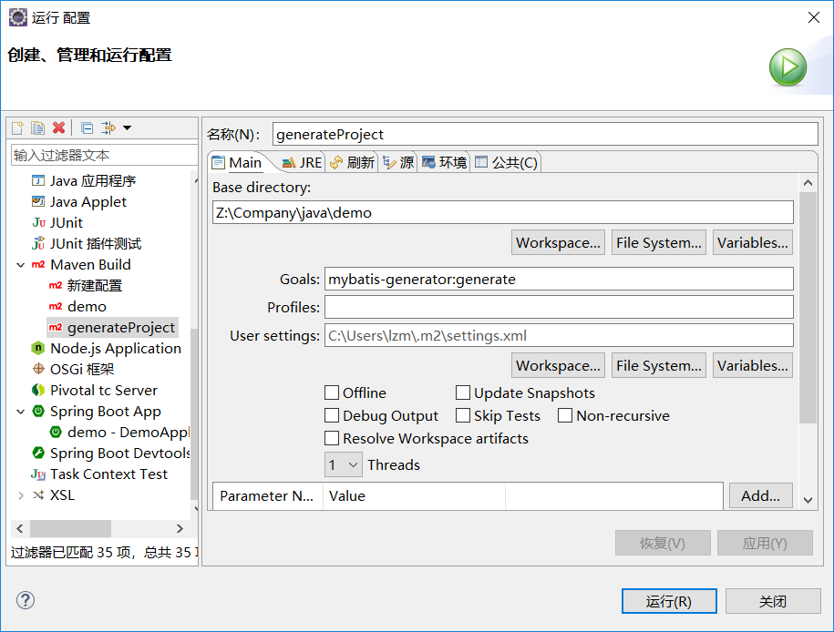
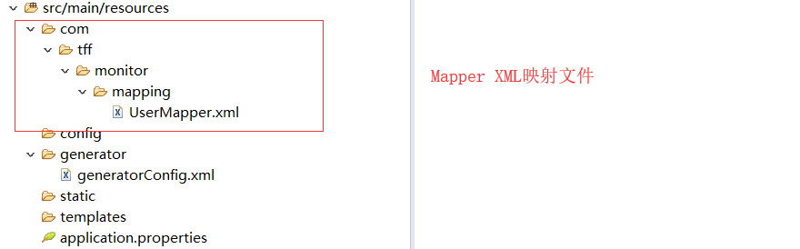
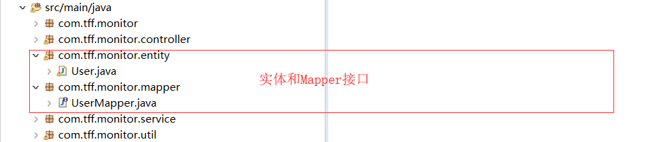

# Spring Boot集成MyBatis

---

# Eclipse 安装spring插件spring tool suite(STS)

1.打开eclipse菜单Help》Eclise Marketplace

2.打开"Popular"标签，然后下拉滚动条，找到SpringToolSuite，并点击“Install”按钮

3.打开对话框，需要加载一些内容，然后复选框会自动全部选中，直接点击按钮“Confirm”

4.安装完成之后重启

# 使用spring tool suite创建项目

1.点击文件，选择新建，然后选择Spring Starter Project

2.填写项目信息

3.选择项目依赖

在SQL标签中,选择MyBatis、MySql、JDBC

在Nosql标签中,选择Redis

在Web标签中，选择Web

4.下一步，等待创建完成

5.添加数据库连接池依赖

编辑pom.xml,在<dependencies></dependencies>添加:

		<dependency>  
            <groupId>com.alibaba</groupId>  
            <artifactId>druid</artifactId>  
            <version>1.0.29</version>  
        </dependency> 
        
结果如下所示:

6.添加mybatis generator 自动生成代码插件

编辑pom.xml,在<build><plugins></build></plugins>添加:

    		<!-- mybatis generator 自动生成代码插件 -->
            <plugin>
                <groupId>org.mybatis.generator</groupId>
                <artifactId>mybatis-generator-maven-plugin</artifactId>
                <version>1.3.2</version>
                <configuration>
                <configurationFile>
                ${basedir}/src/main/resources/generator/generatorConfig.xml
                </configurationFile>
                    <overwrite>true</overwrite>
                    <verbose>true</verbose>
                </configuration>
            </plugin>

结果如下所示:

# 数据库以及Redis参数配置

编辑src/main/resources下的application.properties,进行数据库和Redis参数配置

    #服务端口
    server.port=8002
    #访问前缀，可以标识项目
    server.servlet.context-path=/monitor
    
    #redis数据库配置
    
    #redis数据库编号
    spring.redis.database=0
    #redis 主机名
    spring.redis.host=127.0.0.1
    #redis端口
    spring.redis.port=6379
    #redis密码
    spring.redis.password=
    #redis连接池最大活动连接数
    spring.redis.jedis.pool.max-active=8
    #redis连接池最大等待连接数 -1标识不限制
    spring.redis.jedis.pool.max-wait=-1
    #redis连接池最大空闲连接数
    spring.redis.jedis.pool.max-idle=8
    #redis连接池最小空闲连接数
    spring.redis.jedis.pool.min-idle=0
    #redis超时时间
    spring.redis.timeout=5000

    #数据库配置
    
    #数据库连接
    spring.datasource.url=jdbc\:mysql\://127.0.0.1\:3306/springboots?useUnicode\=true&useUnicode\=false&characterEncoding\=utf8&zeroDateTimeBehavior\=convertToNull  
    #数据库用户
    spring.datasource.username=root
    #数据库密码
    spring.datasource.password=liuzeming
    #数据库驱动名称
    spring.datasource.driver-class-name=com.mysql.jdbc.Driver 
    #数据库连接池类型
    spring.datasource.type=com.alibaba.druid.pool.DruidDataSource 
    #连接池初始大小
    spring.datasource.initialSize=5
    #连接池最小空闲连接数
    spring.datasource.minIdle=5
    #连接池最大活动连接数
    spring.datasource.maxActive=20
    #最大等待连接时间
    spring.datasource.maxWait=60000 
    
    #MyBatis Mapper XML 文件路径
    #mybatis.mapper-locations=classpath:mapper/*Mapper.xml
    mybatis.mapper-locations=classpath:com/tff/monitor/mapping/*Mapper.xml   
    #需要设置别名的实体类路径
    mybatis.type-aliases-package=com.tff.monitor.entity 
    
#编辑MyBatis自动生成代码配置文件

新建${basedir}/src/main/resources/generator/generatorConfig.xml文件,${basedir}指的是项目根目录

    <?xml version="1.0" encoding="UTF-8"?>
    <!DOCTYPE generatorConfiguration
            PUBLIC "-//mybatis.org//DTD MyBatis Generator Configuration 1.0//EN"
            "http://mybatis.org/dtd/mybatis-generator-config_1_0.dtd">
    <generatorConfiguration>
    
        <!-- 数据库驱动位置包-->
        
        <classPathEntry  location="Z:\DevSoftware\java\mysql-connector-java-8.0.11.jar"/>
        <context id="DB2Tables"  targetRuntime="MyBatis3">
            <commentGenerator>
                <property name="suppressDate" value="true"/>
                
                <!-- 是否去除自动生成的注释 true：是 ： false:否 -->
                <property name="suppressAllComments" value="true"/>
                
            </commentGenerator>
            
            <!--数据库链接URL，用户名、密码 -->
            <jdbcConnection driverClass="com.mysql.cj.jdbc.Driver"  connectionURL="jdbc:mysql://127.0.0.1/数据库名称?useSSL=false" userId="用户名" password="用户密码">
            
            </jdbcConnection>
            <javaTypeResolver>
                <property name="forceBigDecimals" value="false"/>
            </javaTypeResolver>
            
            <!-- 根据数据库表生成实体模型的包名和位置-->
            <javaModelGenerator targetPackage="com.tff.monitor.entity" targetProject="src/main/java">
                <property name="enableSubPackages" value="true"/>
                <property name="trimStrings" value="true"/>
            </javaModelGenerator>
            
            <!-- 生成Mapper XML映射文件的包名和位置-->
            <sqlMapGenerator targetPackage="com.tff.monitor.mapping" targetProject="src/main/resources">
                <property name="enableSubPackages" value="true"/>
            </sqlMapGenerator>
            
            <!-- 生成Mapper 接口的包名和位置-->
            <javaClientGenerator type="XMLMAPPER" targetPackage="com.tff.monitor.mapper" targetProject="src/main/java">
                <property name="enableSubPackages" value="true"/>
            </javaClientGenerator>
            
            <!-- 要生成的表 tableName是数据库中的表名或视图名 domainObjectName是实体类名-->
            <!--  enableSelectByExample="false" 表示不生成查询方法-->
            <table tableName="t_user" domainObjectName="User" enableCountByExample="false" enableUpdateByExample="false" enableDeleteByExample="false" enableSelectByExample="false" selectByExampleQueryId="false"></table>
            
        </context>
    </generatorConfiguration>
    
# 对项目做运行参数配置并执行命令(mybatis-generator:generate)

选中项目根目录，右键单击,选择__运行方式__，选择__运行配置__，选中__Maven__ => __Maven Build__ => __新增配置__ =>填写配置参数

填写完成以后，点击__应用__，最后选择__运行__

查看在对应的位置是否生成了__实体类、Mapper XML映射文件、Mapper接口__

生成的结构如图所示:

# 修改UserMapper.xml，支持主键自增

      <insert id="insert" keyProperty="userId" parameterType="com.tff.monitor.entity.User" useGeneratedKeys="true">
      	<selectKey keyProperty="userId" order="AFTER" resultType="java.lang.Long">
      	select LAST_INSERT_ID()
      	</selectKey>
        insert into t_user (user_id, user_name, password, 
          phone)
        values (#{userId,jdbcType=INTEGER}, #{userName,jdbcType=VARCHAR}, #{password,jdbcType=VARCHAR}, 
          #{phone,jdbcType=VARCHAR})
      </insert>
#编辑com.tff.monitor.entity包下的User类,修改userId属性类型为Long,实现序列化接口，重写toString方法

    package com.tff.monitor.entity;

    import java.io.Serializable;
    import java.lang.*;

    public class User implements Serializable{
        private Long userId;
    
        private String userName;
    
        private String password;
    
        private String phone;
    
        public Long getUserId() {
            return userId;
        }
    
        public void setUserId(Long userId) {
            this.userId = userId;
        }
    
        public String getUserName() {
            return userName;
        }
    
        public void setUserName(String userName) {
            this.userName = userName == null ? null : userName.trim();
        }
    
        public String getPassword() {
            return password;
        }
    
        public void setPassword(String password) {
            this.password = password == null ? null : password.trim();
        }
    
        public String getPhone() {
            return phone;
        }
    
        public void setPhone(String phone) {
            this.phone = phone == null ? null : phone.trim();
        }
    
    	@Override
    	public String toString() {
    		return "User [userId=" + userId + ", userName=" + userName + ", password=" + password + ", phone=" + phone
    				+ "]";
    	}
        
    }
#新建包com.tff.monitor.service，定义IUserService接口和UserServiceImpl实现类

IUserService接口如下所示；

    package com.tff.monitor.service;
    
    import com.tff.monitor.entity.User;
    import java.lang.Long;
    
    public interface IUserService {
    	public Long addUser(User user);
    }

UserServiceImpl实现类如下所示:

    package com.tff.monitor.service;
    
    import com.tff.monitor.entity.User;
    import com.tff.monitor.mapper.UserMapper;
    import org.springframework.beans.factory.annotation.Autowired;
    import org.springframework.stereotype.Service;
    import java.lang.Long;
    
    @Service(value = "userService")
    public class UserServiceImpl implements IUserService {
    
    	@Autowired
    	private UserMapper userMapper;
    	
    	public Long addUser(User user) {
    		this.userMapper.insert(user);
    		return user.getUserId();
    	}
    	
    }

#新建包com.tff.monitor.controller，定义UserController

   package com.tff.monitor.controller;

    import com.tff.monitor.entity.User;
    import org.springframework.stereotype.Controller;
    import org.springframework.web.bind.annotation.RequestMapping;
    import org.springframework.web.bind.annotation.ResponseBody;
    
    import javax.servlet.http.HttpServletRequest;
    
    import org.springframework.beans.factory.annotation.Autowired;
    import com.tff.monitor.service.*;
    
    @Controller
    @RequestMapping(value = "/user")
    public class UserController {
    	
        	@Autowired
        	private IUserService userService;
        
        	public IUserService getUserService() {
        		return userService;
        	}
        
        	public void setUserService(IUserService userService) {
        		this.userService = userService;
        	}
        	
        	@ResponseBody
        	@RequestMapping(value="/add")
        	public Long addUser(HttpServletRequest request)
        	{
        		String user_name = (String)request.getParameter("user_name");
        		String phone = (String)request.getParameter("phone");
        		String password = (String)request.getParameter("password");
        		
        		User user = new User();
        		user.setUserName(user_name);
        		user.setPhone(phone);
        		user.setPassword(password);
        		System.out.println(user);
        		return this.userService.addUser(user);
        	}
    	
        }

#新建包com.tff.monitor.util，定义RedisUtil

    package com.tff.monitor.util;
    
    import org.springframework.beans.factory.annotation.Autowired;
    import org.springframework.data.redis.core.RedisTemplate;
    import org.springframework.data.redis.core.StringRedisTemplate;
    import org.springframework.data.redis.core.ValueOperations;
    import org.springframework.stereotype.Component;
    import org.springframework.stereotype.Service;
    import javax.annotation.Resource;
    
    @Component
    public class RedisUtil {
    	
    		@Autowired
    	    StringRedisTemplate stringRedisTemplate;
    		
    	    @Resource(name="stringRedisTemplate")
    	    ValueOperations<String, String> valOpsStr;
    
    	    @Autowired
    	    RedisTemplate<Object, Object> redisTemplate;
    
    	    @Resource(name="redisTemplate")
    	    ValueOperations<Object, Object> valOpsObj;
    
    	    /**
    	     * 根据指定key获取String
    	     * @param key
    	     * @return
    	     */
    	    public String getStr(String key){
    	        return valOpsStr.get(key);
    	    }
    
    	    /**
    	     * 设置Str缓存
    	     * @param key
    	     * @param val
    	     */
    	    public void setStr(String key, String val){
    	        valOpsStr.set(key,val);
    	    }
    
    	    /**
    	     * 删除指定key
    	     * @param key
    	     */
    	    public void del(String key){
    	        stringRedisTemplate.delete(key);
    	    }
    
    	    /**
    	     * 根据指定o获取Object
    	     * @param o
    	     * @return
    	     */
    	    public Object getObj(Object o){
    	        return valOpsObj.get(o);
    	    }
    
    	    /**
    	     * 设置obj缓存
    	     * @param o1
    	     * @param o2
    	     */
    	    public void setObj(Object o1, Object o2){
    	        valOpsObj.set(o1, o2);
    	    }
    
    	    /**
    	     * 删除Obj缓存
    	     * @param o
    	     */
    	    public void delObj(Object o){
    	        redisTemplate.delete(o);
    	    }
    }

#新建RedisController

    package com.tff.monitor.controller;
    import com.tff.monitor.entity.User;
    import com.tff.monitor.util.RedisUtil;
    
    import java.util.Random;
    
    import javax.servlet.http.HttpServletRequest;
    
    import org.springframework.beans.factory.annotation.Autowired;
    import org.springframework.stereotype.Controller;
    import org.springframework.web.bind.annotation.RequestBody;
    import org.springframework.web.bind.annotation.ResponseBody;
    import org.springframework.web.bind.annotation.RequestMapping;
    
    	
    @Controller
    @RequestMapping("/redis")
    public class RedisController {
    
    	@Autowired
    	RedisUtil redisUtil;
    
    	@ResponseBody
    	@RequestMapping(value = "/setStr")
    	public String setStr(HttpServletRequest request){
        	String key = (String)request.getParameter("key");
        	String value = (String)request.getParameter("value");
        	System.out.println(key);
        	System.out.println(value);
        	redisUtil.setStr(key,value);
        	return "success";
        }
    
    @ResponseBody
    	@RequestMapping(value = "/getStr")
    	public String getStr(HttpServletRequest request) {
    		String key = (String)request.getParameter("key");
    		System.out.println(key);
    		return redisUtil.getStr(key);
    	}
    
    @ResponseBody
    	@RequestMapping(value = "/delStr")
    	public String delStr(HttpServletRequest request) {
    		try {
    			String key = (String)request.getParameter("key");
    			System.out.println(key);
    			redisUtil.del(key);
    			return "success";
    		} catch (Exception e) {
    			return "error";
    		}
    	}
    
    	@ResponseBody
    	@RequestMapping(value = "/setObj")
    	public String setObj(HttpServletRequest request) {
    		try {
    			String key = (String)request.getParameter("key");
    			User user = new User();
    			user.setUserId(new Long(1000+new Random().nextInt()));
    			user.setUserName("lzm"+new Random().nextInt());
    			user.setPhone("15502816657");
    			user.setPassword("705721");
    			redisUtil.setObj(key, user);
    			return "success";
    		} catch (Exception e) {
    			e.printStackTrace();
    			return "error";
    		}
    	}
    
    @ResponseBody
    	@RequestMapping(value = "/getObj")
    	public Object getObj(HttpServletRequest request) {
    		String key = (String)request.getParameter("key");
    		System.out.println(key);
    		User user = (User)redisUtil.getObj(key);
    		System.out.println(user);
    		return user.toString();
    	}
    
    @ResponseBody
    	@RequestMapping(value = "/delObj")
    	public Object delObj(HttpServletRequest request) {
    		try {
    			String key = (String)request.getParameter("key");
    			System.out.println(key);
    			redisUtil.delObj(key);
    			return "success";
    		} catch (Exception e) {
    			e.printStackTrace();
    			return "error";
    		}
    	}
    
    }
	

	
# 测试:

新增用户: http://localhost:8002/monitor/user/add?user_name=test&phone=15502816657&password=705721

设置缓存:
http://localhost:8002/monitor/redis/setObj?key=obj2

获取缓存:
http://localhost:8002/monitor/redis/getObj?key=obj2

删除缓存:
http://localhost:8002/monitor/redis/delObj?key=obj2

