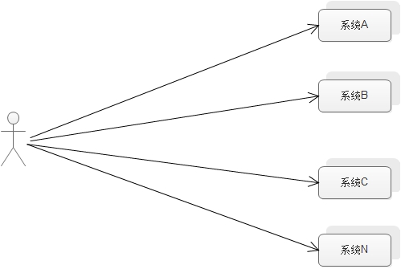
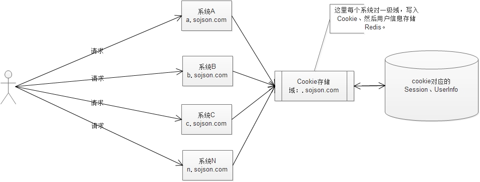
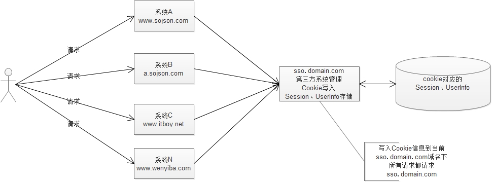

---
title: 单点登录实现思路
date: 2018-04-18 09:06:21
tags:
- 架构
categories:
- 架构
---

<ul>
<li><a href="#introduce">单点登录是什么?</a></li>
<li><a href="#achieve">实现方式</a>
<ul>
<li><a href="#method1">同一根域名，不同子域名</a></li>
<li><a href="#method2">不同域名 sso统一认证中心</a></li>
<li><a href="#method3">不同域名 cas</a></li>
</ul>
</li>
</ul>

<em><h2 id="introduce" style="color:red;">单点登录是什么?</h2></em>

&nbsp;&nbsp;&nbsp;&nbsp;单点登录 （Single Sign On），简称为  SSO  ，SSO 的定义是在多个应用系统中，用户只需要登录一次就可以访问所有相互信任的应用系统。一个用户请求N个系统，给用户的感觉是一个系统的感觉，而不要重复输入密码进行登录。

<em><h2 id="achieve" style="color:red;">实现方式</h2></em>

<em><h3 id="method1" style="color:red;">同一根域名，不同子域名</h3></em>

    域名：a.sojson.com 、b.sojson.com、c.sojson.com、n.sojson.com
    描述：N个系统，但是 一级域名  是一致的,但 二级域名 不同

    PS：这个方案比较简单，只要提供公共的 SDK  即可，不需要第三个系统的出现，这个 SDK  的工作需要管理 Cookie  和用户信息。

    原理：其实质这里就是利用了 二级域名  写 一级域名  的 Cookie  。
    
    优点：轻量级、可插拔、效率非常高。
    
    缺点：1.局限性限于一级域名是一样的。
          2.开发语言必须一致 PHPSESSID JSESSIONID,语言不一致就拿不到cookie了

<em><h3 id="method2" style="color:red;">不同域名 sso统一认证中心</h3></em>

    域名：www.sojson.com、a.sojson.com、www.itboy.net、www.wenyiba.com。

    描述：域名比较乱，有同一个一级域名的（www.sojson.com、a.sojson.com），也有不同域名的。

    原理：所有的请求（登录、退出、获取用户信息、当前用户状态）都请求sso 系统，sso 系统维护用户信息， Session  ，UserInfo。
    实现概要:
        
        系统主要分为 SSO Server, SSO Client , 各个子系统
    
    1.首先浏览器向站点1发起请求。请求的站点1的地址作为queryString参数 redirectUrl= 发现当前请求没有合法的Cookie，那么重定向到SSO Server的某个接口上。
    
    请求的站点1的地址作为queryString参数 redirectUrl= 请求的站点1的地址
    
    SSO Server接口的处理:
    
    1.判断当前浏览器中是否含有标识用户身份的cookie
    
      包含  => 是否过期 => 过期 => 重定向到SSO 登录页面
      
      不包含  => 重定向到SSO 登录页面
      
    2. CAS Server展示登录界面，要求用户登录。
   
    用户登录后，设置标识用户身份的cookie(包含过期时间)，同时创建token(加密以后的用户信息,各个子系统能够解密)，利用一个302跳转到子系统的请求地址。这样能保证用户无感知。
     
     302跳转地址 = redirectUrl?token=XXX
     如果cookie为设置成功,则由前端window.location.href = redirectUrl?token=XXX
    
    3. 子系统利用生成的token发送到SSO Server进行验证，验证通过后，站点1生成自己的Cookie(可以直接为token)并回写到用户浏览器，然后进行登录成功的跳转。
    
    这样就能保证当前浏览器在站点1的域名下，有站点1的Cookie，同时当前浏览器也有SSO Server的Cookie。
    
    4. 站点2，在进行登录时和站点1初次登录流程一致，但是在访问SSO Server的时候，由于当前浏览器已经有了SSO Server的Cookie，那么直接校验通过返回token。
    
    token通过302跳转跳转到子系统，之后的流程就和站点1是一样的了。如果此时认证失败，那么需要重新走一次登录的过程。
    
    其实感觉很麻烦，但是流程却十分的简单，主要是使用SSO Server的Cookie做校验，同时各自系统维护自己的Cookie。
    
    注意的问题：
    
    SSO Server的Cookie劫持问题，如果SSO Server的Cookie被劫持掉，那么就相当于拿到了一切，所以必须要用HTTPS实现这个过程。
    token的使用，token只能被使用一次，一次校验后立即失效。同时需要有时效性，一般5分钟。最后token生成规则要随机，不能被碰撞出来。
    
    对于各自系统自己的Session，也可以依赖于SSO，这样就能保证所有的Session规则一致，便于集中控制。

        优点：实现较为简单。
        
        缺点：SSO 压力非常大。
  
 <em><h3 id="method3" style="color:red;">不同域名 cas</h3></em>  
    
    域名：www.sojson.com、a.sojson.com、www.itboy.net、www.wenyiba.com。
    
    描述：域名比较乱，有同一个一级域名的（www.sojson.com、a.sojson.com），也有不同域名的。
    
    （条件和方案二一样），实现采用 CAS  方式，这里就不做介绍了，资料非常多。
    
    原理：和方案三类似。
    
    优点：现成的，资料较多。
    
    缺点：繁重、灵活性差。

